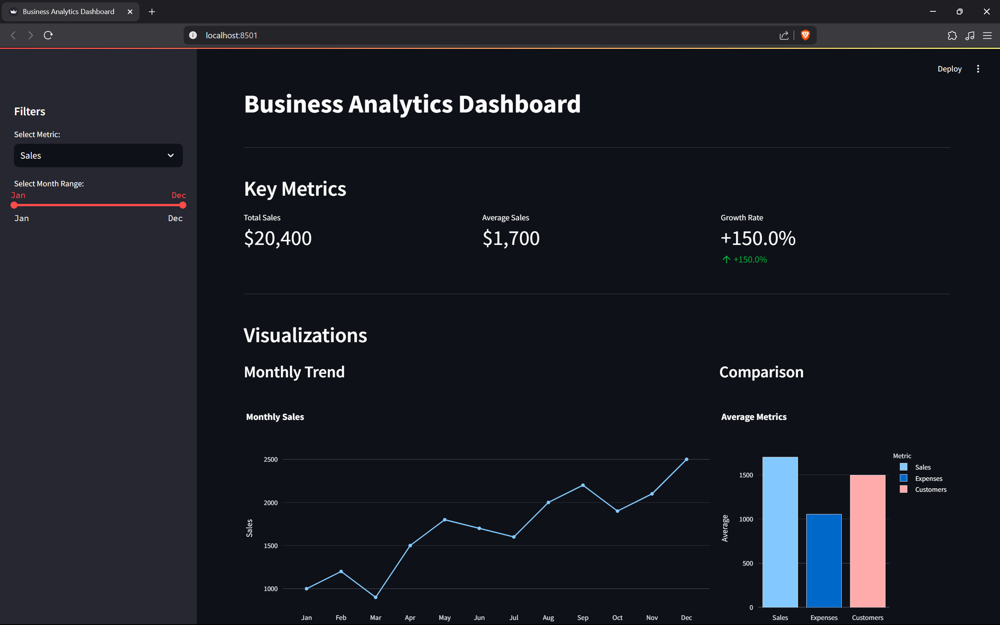
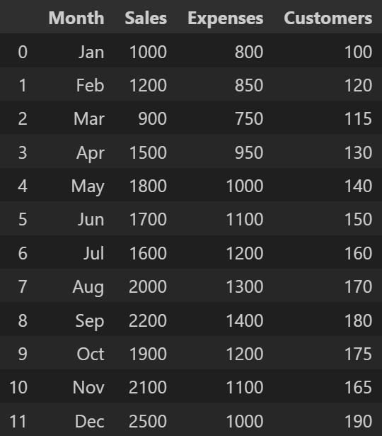
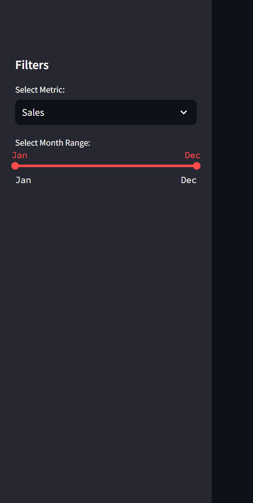
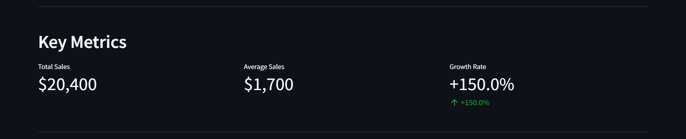
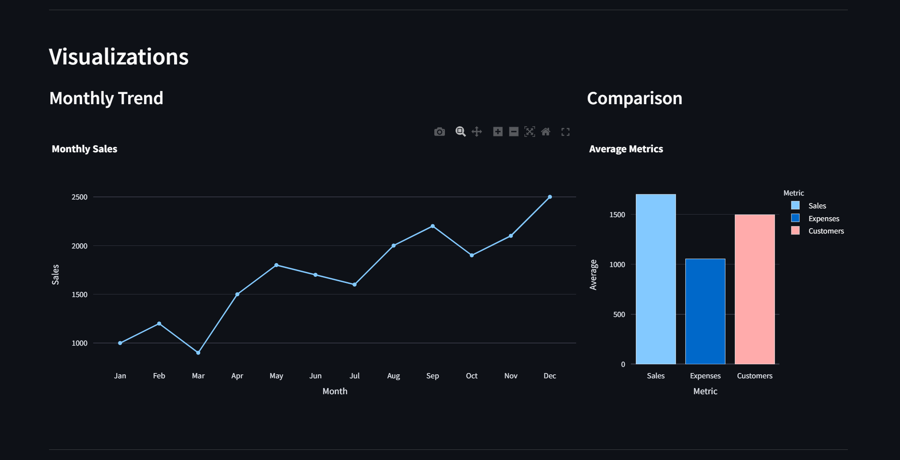
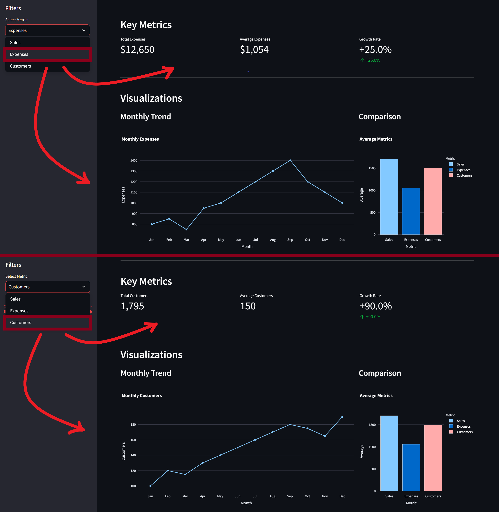

# Dashboard with Streamlit

This tutorial introduces you to building interactive web dashboards using **Streamlit**, a Python framework that turns data scripts into shareable web apps.

## Overview

This dashboard application allows users to:
- View monthly business metrics (Sales, Expenses, Customers)
- Filter data by date range using an interactive slider
- See key performance indicators with delta indicators
- Visualize trends and comparisons through interactive charts

<div style="margin-top: 25px"></div>


## Project Structure

The entire application is contained in a single file:

```
└── app.py            # Complete Streamlit application
```

Always consider making a nice folder/file archicteture for bigger project.

## Getting Started

### Prerequisites

- Python 3.9
- Package manager: `pip` or `conda`

### Installation (virtual environment)

To set up the environment, you can choose between using Python's built-in venv module or the conda package manager, depending on your preference and existing setup.

```bash
python -m venv myenv
source venv/bin/activate  # On Windows: venv\Scripts\activate

pip install dash pandas plotly
```
Using conda package manager:
```bash
conda create --name myenv python=3.9
conda activate myenv

conda install -c conda-forge dash pandas plotly 
# conda install dash pandas plotly
# pip install dash pandas plotly
```

### Running the Application

```bash
streamlit run app.py
```

Your default web browser will automatically open to the local URL (typically http://localhost:8501).

## Streamlit Features Explained

### 1. Application Setup

```python
import streamlit as st
import pandas as pd
import plotly.express as px

st.set_page_config(
    page_title="Business Analytics Dashboard",
    layout="wide"
)
```

Key points:
- Imports for Streamlit, Pandas, and Plotly
- Page configuration to set title and use wide layout
- No explicit server setup required

### 2. Data Management with Caching

```python
@st.cache_data
def load_data():
    return pd.DataFrame({
        'Month': ['Jan', 'Feb', 'Mar', 'Apr', 'May', 'Jun', 'Jul', 'Aug', 'Sep', 'Oct', 'Nov', 'Dec'],
        'Sales': [1000, 1200, 900, 1500, 1800, 1700, 1600, 2000, 2200, 1900, 2100, 2500],
        'Expenses': [800, 850, 750, 950, 1000, 1100, 1200, 1300, 1400, 1200, 1100, 1000],
        'Customers': [100, 120, 115, 130, 140, 150, 160, 170, 180, 175, 165, 190]
    })
```

<div style="margin-top: 25px; text-align:center">
        
</div>

Key features:
- `@st.cache_data` decorator for performance optimization
- Caches data to avoid reloading on each interaction
- Can be extended to load from CSV, databases, or APIs

### 3. User Interface Elements

#### Header and Layout

```python
# Header
st.title("Business Analytics Dashboard")
st.markdown("---")
```

<div style="margin-top: 25px; margin-bottom: 25px;">
    
</div>

Streamlit uses a top-to-bottom flow layout where UI elements appear in the order they're added to the script.

#### Sidebar Filters

```python
# Sidebar filters
st.sidebar.header("Filters")

selected_metric = st.sidebar.selectbox(
    "Select Metric:",
    options=['Sales', 'Expenses', 'Customers'],
    index=0
)

# Convert month index to names for better display
month_names = df['Month'].tolist()
start_month, end_month = st.sidebar.select_slider(
    "Select Month Range:",
    options=range(len(month_names)),
    value=(0, 11),
    format_func=lambda x: month_names[x]
)
```

<div style="margin-top: 25px; margin-bottom: 25px;">
    
</div>

Key features:
- Sidebar container for controls
- Interactive widgets:
  - Selectbox for choosing metrics
  - Select slider for date range with custom formatting
- Immediate reactivity without explicit callbacks

#### Metrics Display

```python
# Key Metrics Section
st.header("Key Metrics")
col1, col2, col3 = st.columns(3)

# Calculate metrics
total, avg, growth = calculate_metrics(filtered_df, selected_metric)

# Display metrics
with col1:
    st.metric(
        label=f"Total {selected_metric}", 
        value=format_metric_value(total, selected_metric)
    )

with col2:
    st.metric(
        label=f"Average {selected_metric}", 
        value=format_metric_value(avg, selected_metric)
    )
    
with col3:
    st.metric(
        label="Growth Rate", 
        value=f"{growth:+.1f}%",
        delta=f"{growth:+.1f}%"
    )
```

<div style="margin-top: 25px; margin-bottom: 25px;">
    
</div>

Key features:
- Column layout using `st.columns()`
- Context manager (`with` statement) for placing elements in columns
- `st.metric()` component for key figures with delta indicators

#### Charts Integration

```python
# Create two columns for charts
col1, col2 = st.columns([2, 1])

# Line Chart
with col1:
    st.subheader(f"Monthly {selected_metric}")
    line_fig = update_line_chart(filtered_df, selected_metric)
    st.plotly_chart(line_fig, use_container_width=True)

# Bar Chart
with col2:
    st.subheader("Average Metrics Comparison")
    bar_fig = update_bar_chart(filtered_df)
    st.plotly_chart(bar_fig, use_container_width=True)
```

<div style="margin-top: 25px; margin-bottom: 25px;">
    
</div>

Key features:
- Flexible column layout with ratio specifications ([2, 1])
- Native integration with Plotly figures
- Responsive container width option

### 4. Data Processing and Visualization

#### Chart Generation with Plotly

```python
def update_line_chart(df, metric):
    fig = px.line(
        df,
        x='Month',
        y=metric,
        markers=True,
        title=f'Monthly {metric} Trend'
    )
    fig.update_layout(
        xaxis_title='Month',
        yaxis_title=metric,
        template='plotly_white'
    )
    return fig
```

Key features:
- Plotly Express for simplified chart creation
- Dynamic chart generation based on selected metrics
- Consistent styling with templates

#### Metric Calculations

```python
def calculate_metrics(df, metric):
    total = df[metric].sum()
    avg = df[metric].mean()
    first = df[metric].iloc[0]
    last = df[metric].iloc[-1]
    growth = ((last - first) / first) * 100 if first > 0 else 0
    
    return total, avg, growth
```

## Key Streamlit Concepts

### State Management and Reactivity

Streamlit maintains application state and automatically re-runs your script from top to bottom when:
- A user interacts with a widget
- A function decorated with `@st.cache_data` has new data

This execution model creates a reactive application without explicit callback definitions.

<div style="margin-top: 25px; margin-bottom: 25px;">
    
</div>

### Layout System

Streamlit offers several layout options:
1. **Main area**: Default flow layout (top to bottom)
2. **Sidebar**: Collapsible navigation panel
3. **Columns**: Horizontal divisions with customizable widths
4. **Expanders**: Collapsible sections
5. **Tabs**: Tabbed interface for organizing content

### Caching for Performance

The `@st.cache_data` decorator prevents redundant computations by:
1. Computing the function's return value on first run
2. Storing the result in a cache
3. Returning the cached result on subsequent runs with the same inputs

## Advantages of Streamlit

### Rapid Development

- Single-file application structure
- No callbacks or HTML/CSS required
- Automatic UI updates

### Built-in Components

- Interactive widgets (sliders, dropdowns, etc.)
- Data visualization tools
- Media elements (images, videos)
- Layout containers

## Next Steps

Now that you understand the basics, try:
- Adding more interactive filters
- Creating additional pages
- Integrating with databases
- Customizing the theme
